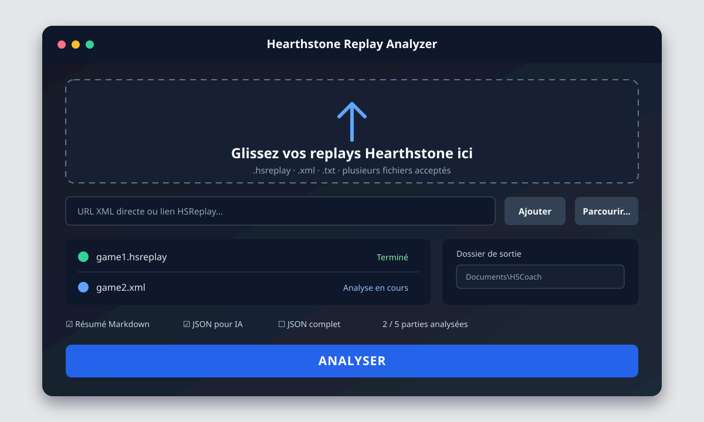

# Hearthstone Replay Analyzer

Transformez un replay Hearthstone en un rapport français clair, anonymisé et optimisé
pour l’analyse par IA.

HSCoach est un extracteur factuel : il décrit ce que le replay permet d’observer. Il ne
note pas les plays, ne propose pas de meilleur coup, ne prédit pas la main adverse et
n’invente jamais une causalité absente du protocole.

La V3 ajoute une application desktop Windows, l’analyse par lots et une couche
applicative commune à la GUI et à la CLI. Le moteur conserve la chronologie exacte de
la V2, distingue la provenance d’une entité de sa création observée et modélise les
passages Dormant sans faux debuff.



> Cet aperçu est une maquette sobre, sans asset Blizzard. L’apparence exacte dépend du
> thème et de la mise à l’échelle Windows.

## Fonctionnalités

- fichiers locaux `.hsreplay`, `.xml` et `.txt`, seuls ou en lot ;
- glisser-déposer Windows et sélecteur de fichiers ;
- URL HTTP/HTTPS pointant directement vers un XML HSReplay, y compris les URL S3
  signées ;
- interface française, redimensionnable et non bloquante pendant l’analyse ;
- dossier de sortie et formats mémorisés entre les lancements ;
- rapport Markdown lisible, JSON compact pour IA et JSON technique complet ;
- cartes et textes Hearthstone résolus en `frFR` sans fallback anglais silencieux ;
- chronologie à quatre frontières, actions, décisions et deltas avant/après ;
- anonymisation et contrôle de confidentialité avant chaque écriture ;
- CLI préservée pour l’automatisation et le diagnostic.

## Installation utilisateur sous Windows

Lorsqu’une archive Windows sera publiée dans une Release, elle contiendra un dossier
`HSCoach` à conserver entier : l’exécutable et ses dépendances fonctionnent ensemble.

1. Lorsqu’elle existe, téléchargez l’archive Windows depuis la page **Releases** du projet.
2. Extrayez-la dans un dossier où votre compte peut écrire, par exemple Documents.
3. Ouvrez le dossier `HSCoach`.
4. Lancez `HSCoach.exe`.
5. Déposez un ou plusieurs replays, choisissez le dossier de sortie, puis cliquez sur
   **ANALYSER**.

Python et les droits administrateur ne sont pas nécessaires pour le bundle. Une archive
non signée peut déclencher Windows SmartScreen. Vérifiez que l’archive provient bien
de la page officielle du projet avant de l’exécuter.

Au premier lancement sans cache valide, les données françaises de cartes doivent être
téléchargées. Une fois ce cache créé, les analyses suivantes peuvent fonctionner hors
ligne.

## Utilisation de l’interface

La fenêtre principale contient :

1. une zone **Glissez vos replays Hearthstone ici** ;
2. un bouton **Parcourir...** pour sélectionner plusieurs fichiers ;
3. un champ **Ou collez une URL** et un bouton **Ajouter** ;
4. un champ de collage XML brut et le bouton **Analyser ce texte** ;
5. une liste indiquant pour chaque source `En attente`, `Analyse en cours`, `Terminé`
   ou `Erreur` ;
6. le choix du dossier de sortie ;
7. les formats à produire ;
8. le bouton **ANALYSER**, la progression réelle du lot et les résultats.

Les valeurs par défaut sont :

- Résumé Markdown : activé ;
- JSON pour IA : activé ;
- JSON complet : désactivé ;
- ouvrir le dossier après analyse : configurable.

Le dossier initial est `Documents/HSCoach`. Le cache est placé dans le répertoire de
cache propre à l’utilisateur fourni par Windows/Qt ; ni l’un ni l’autre ne requiert de
droit administrateur. Le traitement est séquentiel et ne bloque pas la fenêtre. Si une
source échoue dans un lot, les autres sont tout de même analysées. L’annulation empêche
le lancement des éléments encore en attente ; un parsing déjà commencé peut devoir se
terminer proprement.

Les boutons de résultat ouvrent le résumé ou son dossier avec l’application système.
Aucune donnée n’est envoyée à un service d’IA.

## Sources prises en charge

| Source | Statut | Remarque |
|---|---|---|
| Fichier `.hsreplay`, `.xml` ou `.txt` | Pris en charge | Le contenu doit être un XML HSReplay valide. |
| Contenu XML brut collé | Pris en charge | Même validation et même `AnalysisService` que les autres sources. |
| URL directe vers le XML | Pris en charge | HTTP/HTTPS, 50 Mio et 20 s par défaut. |
| URL S3 signée | Pris en charge | Sa query string n’est ni affichée ni journalisée. |
| `https://hsreplay.net/replay/<ID>` | Non pris en charge | La page est reconnue, mais elle n’est pas scrapée. |
| Page HTML arbitraire | Refusée | Une page web n’est jamais interprétée comme un replay. |

### Liens publics HSReplay

Les liens de page `hsreplay.net/replay/<ID>` ne disposent pas actuellement d’une
méthode publique, documentée et suffisamment stable permettant à HSCoach d’obtenir le
XML brut. Le projet n’utilise aucun endpoint privé et ne contourne aucune protection du
site. L'application indique quatre étapes manuelles : ouvrir les outils de
développement du navigateur avec F12, afficher l'onglet Réseau, recharger en filtrant
sur `.xml`, puis copier l'URL `.hsreplay.xml`. Cette URL directe est temporaire et doit
être utilisée avant son expiration, ou téléchargée comme fichier local.

Le type `HsReplayPageSource` reste séparé du moteur afin qu’une future API officielle
puisse être ajoutée sans modifier le parsing. Le support ne sera activé qu’avec une
interface documentée ou une autorisation explicite de HSReplay.net. La recherche et sa
décision sont consignées dans
[docs/HSREPLAY_PUBLIC_PAGES.md](docs/HSREPLAY_PUBLIC_PAGES.md).

## Rapports produits

Chaque partie possède son propre sous-dossier `<date>-<matchup>-<game-id>` sécurisé
dans le répertoire choisi. Selon les cases cochées, HSCoach crée :

```text
<dossier-de-sortie>/<date>-<matchup>-<game-id>/
├── game_summary.md
├── game_llm.json
└── game_analysis.json
```

`game_summary.md` est destiné à la lecture humaine. `game_llm.json`, au schéma
`hscoach-llm/1.0`, centralise les définitions de cartes et évite les répétitions inutiles.
`game_analysis.json`, au schéma `2.0`, conserve les paquets classés, diagnostics et
données techniques nécessaires à l’audit.

Dans le JSON compact, une carte adverse encore cachée reçoit un alias opaque et
déterministe tel que `hidden:h1`. Cet alias ne contient aucun identifiant protocolaire et
n’est jamais relié à l’entité publique si la carte est révélée plus tard. Le JSON complet
conserve en revanche les identifiants protocolaires nécessaires au diagnostic : bien
qu’anonymisé et contrôlé contre les données de compte, il ne doit pas servir directement
d’entrée de coaching lorsque l’isolation temporelle des cartes cachées est requise.

Exemple simplifié de faits rendus :

```text
- Acolyte radieuse reçoit +3/+3 : 1/2 → 4/5.
- Acolyte radieuse devient Dormante.
- Acolyte radieuse se réveille : 4/5.
```

Une relation `CREATOR` est exportée comme provenance historique. Elle ne devient un
événement `CARD_CREATED` que lorsque la chronologie démontre réellement cette création
ou cette entrée dans la partie à cet instant. Les enchantements internes inutiles au
raisonnement restent dans le JSON technique, mais ne polluent pas le résumé ou les
événements importants.

## Chronologie factuelle

Un `turn` représente le demi-tour d’un seul côté. Ses quatre snapshots publics ne sont
pas interchangeables :

```text
MAIN_READY       MAIN_ACTION          MAIN_END             MAIN_CLEANUP
     │                │                   │                      │
turn_start   action_phase_start   action_phase_end          turn_end
     └─ pioche et triggers ─┘      └─ triggers de fin ──────────┘
```

- `turn_start_state` : avant la pioche et les triggers de début suivants ;
- `action_phase_start_state` : au moment où le joueur peut décider ;
- `action_phase_end_state` : après les actions, avant les triggers de fin ;
- `turn_end_state` : après les triggers de fin.

Une frontière absente reste `null` avec un avertissement. Une concession ne fabrique
pas une fausse fin de tour. Une carte adverse cachée reste inconnue à l’instant concerné,
même si son identité est révélée plus tard.

## Installation développeur

Python 3.11 ou plus récent est requis. Sous PowerShell :

```powershell
py -3.11 -m venv .venv
.\.venv\Scripts\Activate.ps1
python -m pip install --upgrade pip
python -m pip install -e ".[dev,gui,build]"
```

Sous Linux ou macOS, remplacez l’activation par
`source .venv/bin/activate`. La GUI Qt est principalement validée sous Windows ; le
moteur et la CLI restent des paquets Python ordinaires.

Validation complète :

```powershell
python -m pytest
python -m ruff check .
python -m ruff format --check .
```

Les tests GUI utilisent Qt en mode hors écran lorsque nécessaire. Ils vérifient le
contrôleur, les réglages, les lots, les erreurs et l’appel à la couche applicative ; ils
ne comparent pas des pixels.

## Utilisation CLI

La commande historique reste disponible :

```powershell
python -m hscoach analyser chemin\partie.hsreplay
python -m hscoach inspecter chemin\partie.hsreplay
python -m hscoach actualiser-cartes
python -m hscoach configuration
```

Le menu interactif s’ouvre avec `python -m hscoach`. L’option globale `--verbose` doit
précéder la sous-commande :

```powershell
python -m hscoach --verbose analyser chemin\partie.hsreplay
```

Le fallback anglais reste volontaire et propre à une analyse :

```powershell
python -m hscoach analyser chemin\partie.hsreplay --allow-en-fallback
```

Pour lancer la GUI depuis l’environnement de développement :

```powershell
hscoach-gui
# ou
python -m hscoach.gui
```

## Architecture

La GUI et la CLI utilisent la même frontière applicative. Aucune logique Hearthstone
n’est copiée dans l’interface :

```text
CLI ───────────────┐
                   ├──> AnalysisService ──> entrées sécurisées
GUI PySide6 ───────┘                         ├──> parser HearthSim
                                             ├──> reconstruction factuelle
                                             └──> exports anonymisés
```

```text
src/hscoach/
├── application/          requêtes, résultats et service partagé
├── gui/                  fenêtre, contrôleur, worker et réglages Qt
├── input/                fichiers, résolveurs de sources et HTTP(S)
├── cards/                HearthstoneJSON, cache et localisation frFR
├── replay/               parsing, phases, deltas et timeline
├── models/               contrats de données
├── output/               Markdown, JSON complet et JSON LLM
├── cli.py                commandes françaises
└── privacy.py            anonymisation et garde avant écriture
```

Overwolf n’est plus une direction active du projet. L’ancien document de réflexion est
conservé comme historique dans [docs/OVERWOLF.md](docs/OVERWOLF.md).

## Construire l’application Windows

L'environnement de build verrouillé et reproductible utilise CPython 3.11 x64, les versions exactes de
`requirements/release.txt` et PyInstaller en mode **one-folder** sur Windows :

```powershell
.\scripts\build_windows.ps1
```

Pour mettre à jour l’environnement de Release, modifiez les contraintes, recréez un
environnement Python 3.11 x64 propre, exécutez tous les contrôles et régénérez
`requirements/release.txt` à partir des versions effectivement validées.

Le résultat attendu est `dist/HSCoach/HSCoach.exe`. PyInstaller n’est pas un
cross-compilateur : une Release Windows doit être construite et testée sur Windows.
Le script recopie la licence du projet, les notices et les textes GPL/LGPL requis dans
le dossier distribué. Il n’embarque aucun replay ni cache utilisateur et exécute un
smoke test de l’exécutable. Une publication binaire exige encore l’audit des composants
Qt réellement embarqués et de leurs notices ; la checklist ci-dessous traite ce point
comme un gate de Release.

La checklist détaillée se trouve dans
[docs/MANUAL_TESTING.md](docs/MANUAL_TESTING.md).

## Confidentialité et sécurité

- Les côtés deviennent `JOUEUR`/`ADVERSAIRE` ou `PLAYER`/`OPPONENT` dans les rapports.
- BattleTags, noms de comptes, `accountHi`, `accountLo`, credentials, tokens et
  signatures sont interdits dans les exports.
- La query string d’une URL signée n’est ni affichée, ni loggée, ni persistée dans les
  réglages.
- Aucun historique de replay ou d’URL n’est conservé par la GUI.
- Les sous-ensembles DTD internes et les déclarations d’entité sont refusés. Le
  `DOCTYPE` externe simple officiel est accepté sans résolution de ressource ; aucun
  fichier déposé n’est exécuté ou extrait comme archive.
- Taille, timeout, racine XML et dossier de sortie sont validés.
- `samples/`, `output/`, `.cache/`, `.venv/`, `dist/` et `build/` sont ignorés par Git.

Le Markdown et le JSON compact sont conçus pour être partageables. Le JSON complet est
un rapport de diagnostic anonymisé, mais ses identifiants protocolaires peuvent relier
une entité cachée à sa révélation ultérieure. Le replay brut reste une donnée privée. Ne
l’ajoutez jamais à un ticket ou à un dépôt public.

## Limites

- HSCoach décrit uniquement la partie jouée et ne simule aucune alternative.
- Les options enregistrées par le client ne couvrent pas toutes les lignes stratégiques.
- Une source causale non explicitement reliée à sa cible reste « Source non attribuée ».
- Certaines interactions récentes peuvent rester « Événement non classifié ».
- Une annulation ne tue pas brutalement un parseur déjà en cours.
- Les pages publiques HSReplay ne sont pas résolues vers le XML.
- Le cache de cartes doit être téléchargé au moins une fois avant un usage hors ligne.
- HSCoach préfère le snapshot HearthstoneJSON du build du replay. Si ce snapshot est
  indisponible, le repli sur `latest` est signalé dans les avertissements et métadonnées.
- Une archive Windows non signée peut déclencher SmartScreen ; la signature de code
  est un chantier de distribution distinct.

## Roadmap

- activer les pages HSReplay uniquement si une API officielle adaptée apparaît ;
- enrichir les fixtures synthétiques des interactions Hearthstone encore non classées ;
- ajouter signature de code et automatisation de Release lorsque le dépôt public est
  configuré.

## Licence et marques

Le code du projet est distribué sous licence MIT ; consultez [LICENSE](LICENSE).
PySide6 et Qt conservent leurs propres licences, notamment LGPLv3/GPLv3 ou commerciale,
et leurs notices doivent rester avec une distribution binaire.

Hearthstone est une marque de Blizzard Entertainment. HSReplay.net est un service de
HearthSim. Ce projet communautaire n’est affilié ni à Blizzard Entertainment, ni à
HearthSim, et n’embarque aucun asset propriétaire de ces sociétés.
